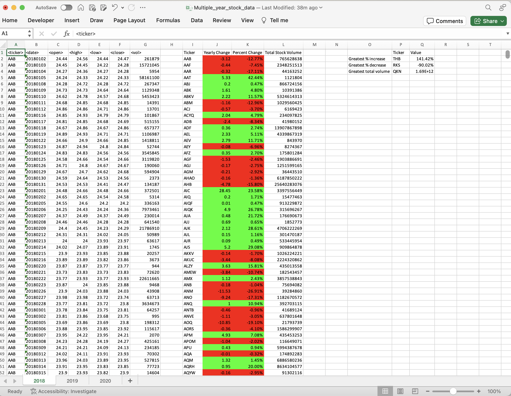
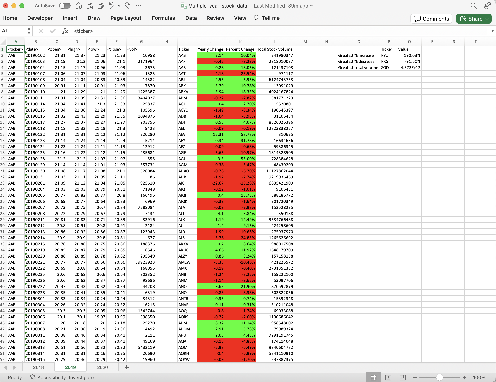
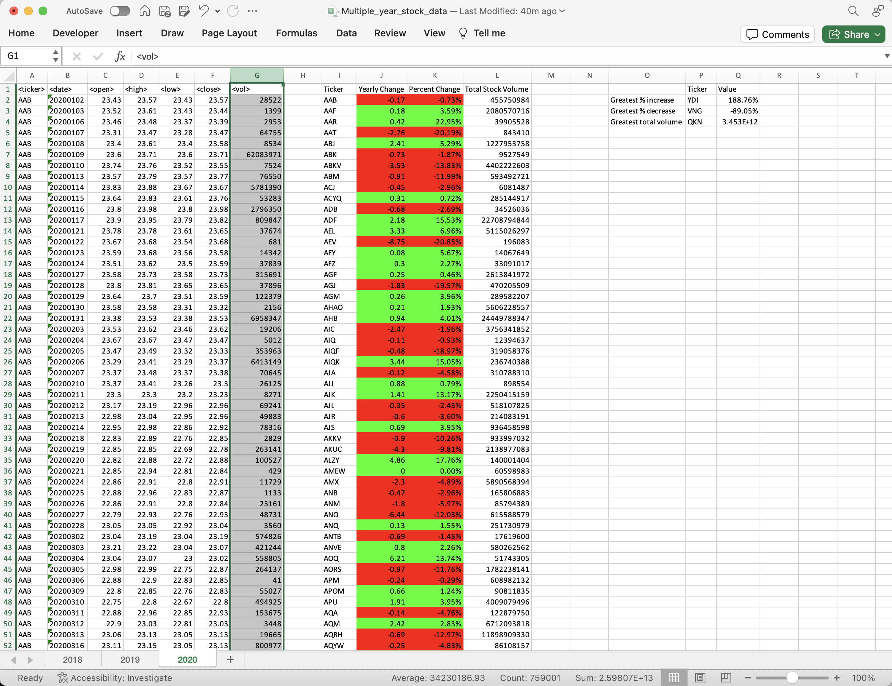

# Challenge 2 - VBA Script

--

This Visual Basic for Applications script will cycle through stock data in an Excel spreadsheet and summarise the data for the year.

There are three screen captures in this folder showing the top part of each of the final outputs.

2018 screen capture

2019 screen capture

2020 screen capture

Student Tyson Horsewell
